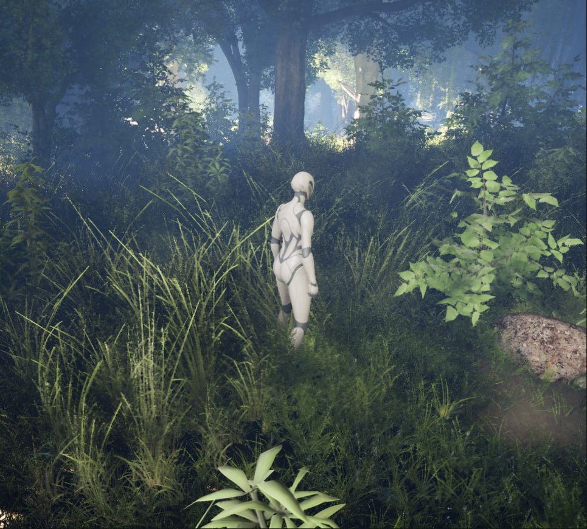
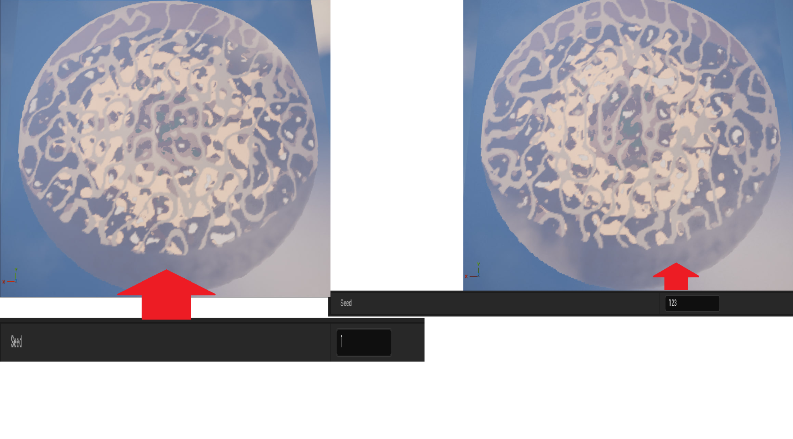
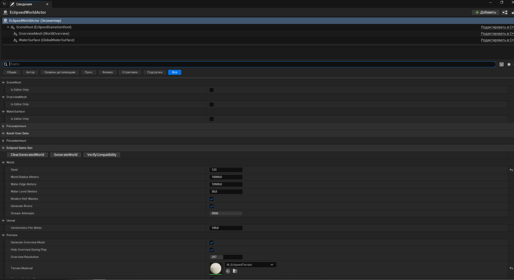
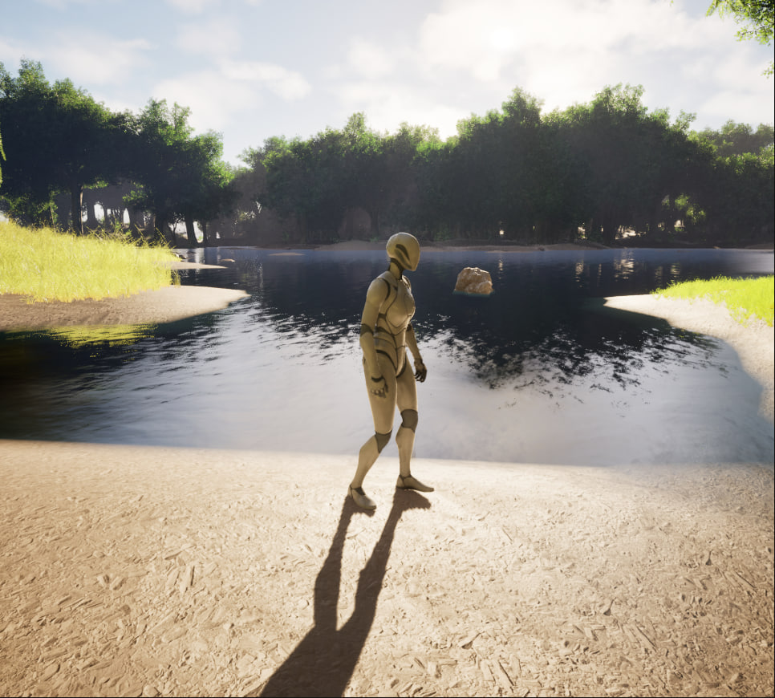
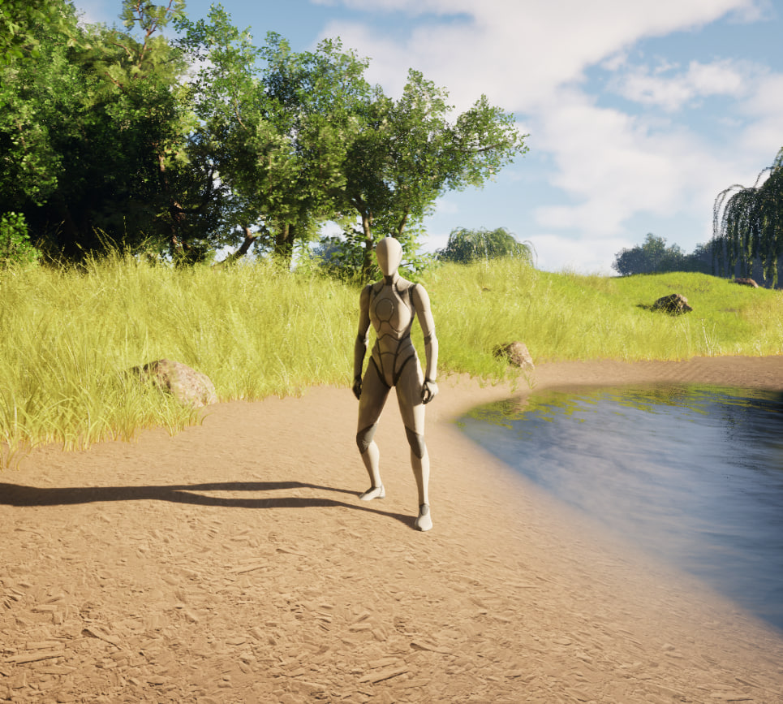

# Eclipsed GameGen

**Eclipsed GameGen** ist ein Unreal-Engine-5-Plugin zur prozeduralen Generierung großer Spielwelten für Survival- und RPG-Projekte. Es entstand im Rahmen meines eigenen UE5-Spielprojekts und befindet sich aktuell in aktiver Entwicklung.

[▶ Video-Demo auf YouTube](https://youtu.be/seCXZJKlyvI)



## Projektziel

Das System erzeugt reproduzierbare Spielwelten auf Basis eines **Seeds**. Gelände, Biome, Wasser, Vegetation und weitere Umgebungsobjekte werden regelbasiert aufgebaut. Die Weltlogik ist bewusst modular von den eigentlichen Assets getrennt, damit Materialien, Vegetation und Strukturen ausgetauscht oder erweitert werden können, ohne die grundlegende Generierungslogik neu aufzubauen.

## Technischer Fokus

- Unreal Engine 5
- C++ Plugin-Architektur
- Seed-basierte, deterministische Weltgenerierung
- Zonenbasierte Weltstruktur und Runtime-Streaming
- Mehrere Biome mit gewichteten Übergängen
- Prozedurale Höhen, Küsten, Flüsse und Streams
- Globales Water Level
- Biombasierte Vegetations- und Clutter-Regeln
- Regelbasierte Platzierung von Bäumen, Felsen, Gras und weiteren Objekten
- Editor-Parameter für schnelle Iteration und Tests

## Generierungslogik

```text
Seed
  ↓
Terrain / Höhe
  ↓
Biome
  ↓
Wasser / Flüsse
  ↓
Vegetation / Clutter
  ↓
Generierte Spielwelt
```

## Seed-basierte Weltgenerierung

Unterschiedliche Seeds erzeugen unterschiedliche Weltlayouts. Derselbe Seed kann reproduzierbar erneut verwendet werden.



## Editor-Integration

Zentrale Parameter der Weltgenerierung können direkt im Unreal Editor angepasst und getestet werden. Dadurch lassen sich Änderungen schnell iterieren und verschiedene Konfigurationen vergleichen.



## Beispielwelten

| Wasser / Ufer | Offenes Biom |
|---|---|
|  |  |

## Mein Entwicklungsbeitrag

Mein Schwerpunkt liegt auf der **Konzeption der gewünschten Weltlogik**, der Definition von Regeln und Anforderungen, der Integration in das UE5-Projekt, dem Testen verschiedener Seeds und Parameter sowie auf **Fehleranalyse, Debugging und iterativer Weiterentwicklung**.

## Aktueller Status

Das Projekt befindet sich in aktiver Entwicklung. Geplant sind unter anderem:

- komplexere Strukturplatzierung
- interaktive Ressourcen
- weitere Biome und Varianten
- zusätzliche Wasser- und Umgebungseffekte
- weitere Optimierungen der Weltgenerierung

## Demo

**YouTube:** https://youtu.be/seCXZJKlyvI

---

**Ivan Shabelnyk**  
Projektportfolio für Bewerbungen im Bereich Fachinformatik / Anwendungsentwicklung
